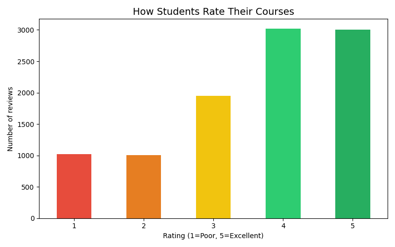
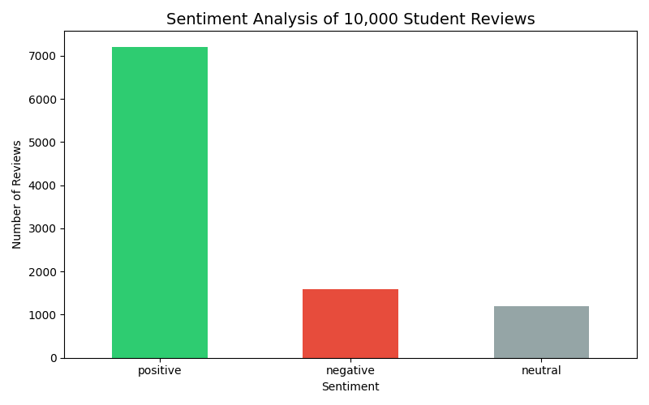
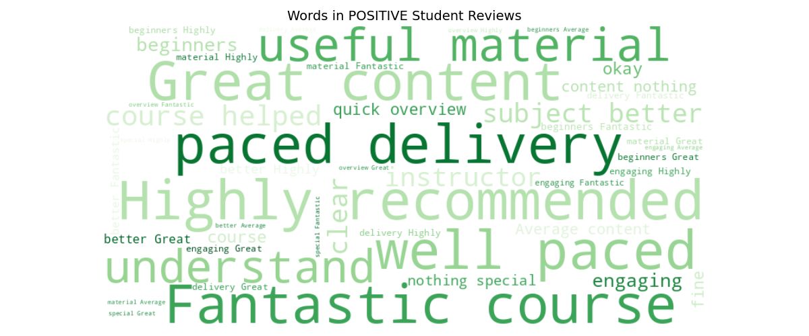
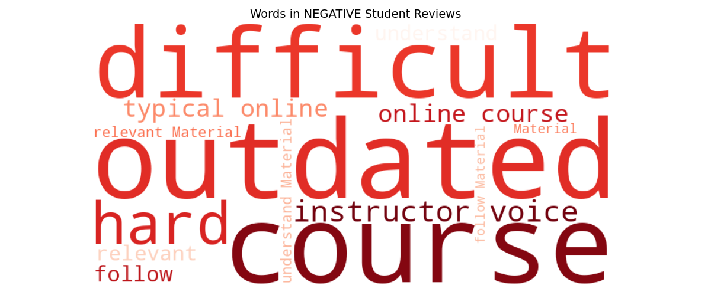

# What Makes Great Teaching?
### NLP Sentiment Analysis of 10,000 Student Reviews

**Author:** Krishna Varshini Ilindra
**Tools:** Python, TextBlob, WordCloud, Pandas, Matplotlib
**Dataset:** Online Learning Platform Reviews (Kaggle)

## Research Question
As a former Teaching Assistant, I wanted to understand: 
what do students actually value in great teaching — using 
data, not assumptions.

## Key Findings
- 72.1% of reviews carry positive sentiment
- 30% of students gave 5-star ratings
- Positive reviews highlight: paced delivery, engaging 
  content, clear explanation
- Negative reviews highlight: outdated material, 
  difficult to understand, irrelevant content

## Implication
Instructors should prioritize clear pacing, current 
content, and engagement to improve student satisfaction.

## Charts

